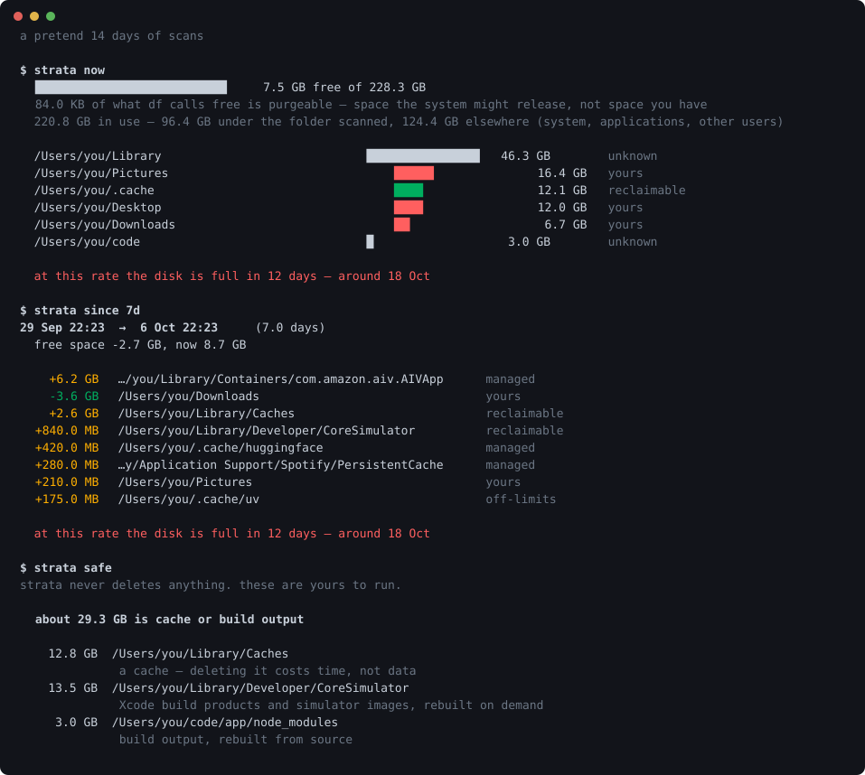

# strata

[](https://github.com/KRISH123no/strata/actions/workflows/ci.yml)



**Where the disk went, and what is still going.** macOS tells you "System Data: 47 GB" and stops.
That is not a summary, it is a refusal. This takes a snapshot every night, and then answers the
question you actually have — *what ate three gigabytes since Tuesday* — which no single listing can.

It never deletes anything. It prints the command and leaves it to you.

```bash
pip install -e ".[dev]"
strata demo            # see what it does, with no history of your own
strata scan            # take the first snapshot
strata install         # and one every night from now on

strata since 7d        # the reason this exists
strata now             # what is big right now
strata safe            # what is only cache, and the command to clear it
```

No dependencies. Everything it needs ships with macOS and with Python.

## The part a listing cannot tell you

One scan says what is **big**. Everyone already knows what is big — the photo library, the browser,
the models you downloaded once. That was never the question. The question is what *changed*, and
only a history answers it:

```
$ strata since 7d
29 Sep 22:21  →  6 Oct 22:21   (7.0 days)
  free space -2.7 GB, now 8.7 GB

    +6.2 GB  …/Library/Containers/com.amazon.aiv.AIVApp   managed
    -3.6 GB  ~/Downloads                                  yours
    +2.6 GB  ~/Library/Caches                             reclaimable
  +840.0 MB  ~/Library/Developer/CoreSimulator            reclaimable

  at this rate the disk is full in 12 days — around 18 Oct
```

## Attribution is the hard part, not subtraction

If `~/.cache/uv` grows by two gigabytes then so does `~/.cache`, and `~`, and `/Users`. All four are
true, and printing all four is the same two gigabytes four times — each row a slightly longer path.
A report that does that has handed the arithmetic back to the reader.

So every directory is charged only with **what its children do not explain**. Walk deepest-first,
attribute each change to the most specific path that accounts for it, subtract it from the nearest
ancestor that is itself reported, and a parent appears only when it grew for reasons of its own.

"Nearest *reported*" carries weight: directories under the size floor are not stored, so the chain
has gaps, and stopping at the first missing link would leave the growth charged to nobody.

The same rule governs `now` and `safe`. Every row is space no other row also counts, so a column of
figures adds up to something real.

## What macOS does not volunteer

**`df` counts purgeable space as free.** On APFS, space held by caches and snapshots that the system
*could* release is reported as available. It is a promise, not a fact, and you find out the
difference when a copy fails on a disk that said it had room. `diskutil` knows the real number, so
strata reports both and names the gap.

**Local snapshots are invisible.** Time Machine leaves them on the boot volume. They hold real
gigabytes and appear in no walk, in Finder, or in About This Mac — a large part of what Apple files
under "System Data".

**`du` counts hard links and clones once per name.** A file reachable down three paths is three
files to `du` and one file to the disk. Copy a folder in Finder and APFS clones it: no new bytes,
and a naive walk reports the space twice. Every file here is counted once, by inode.

## It will not delete your things

Four kinds, and the distinction is the whole point:

| | |
|---|---|
| **reclaimable** | a cache or build output. Deleting it costs time, not data |
| **managed** | an app's own store — emptied from inside the app, not with `rm` |
| **yours** | documents, code, pictures. Never suggested, ever |
| **off-limits** | caches that are ruinous to rebuild. Reported, never recommended |

`strata safe` only ever lists the first kind, and only when nothing protected sits inside it.
`~/.cache` looks exactly like a cache and holds the package caches that must not be touched;
suggesting the parent would be suggesting its children.

## What the tests check

```bash
pytest -q      # 112 tests, under a second
ruff check .
```

Only `volume.py` needs a Mac, and it shells out to `df`, `diskutil` and `tmutil` — each one a seam a
test replaces with a canned answer. Everything else is arithmetic over dataclasses, so CI runs on
Linux too.

Bugs the suite caught:

- **A grandparent reported losing two gigabytes it never had.** Passing a change up to *every*
  ancestor counts the same bytes once per level, because a parent's own figure already includes them
  and it passes that figure up in turn.
- **`strata safe` offered `~/.cache`** — 12 GB of "cache" with the protected package caches inside it.
- **The demo had a folder that shrank while its contents grew.** Impossible in a real tree; it came
  from inventing parent totals instead of rolling them up from the leaves. The attribution was right
  and the data was wrong.
- **Multi-line expressions inside f-strings** are Python 3.12, and this claims 3.11.

## Layout

| File | Lines | Role |
|---|---:|---|
| `cli.py` | 367 | the commands and the nightly agent |
| `report.py` | 175 | bars, sizes, and what is safe to say |
| `walk.py` | 153 | sizing a tree, counting each file once |
| `classify.py` | 111 | what a directory is, and whether to touch it |
| `store.py` | 137 | the history, in one SQLite file |
| `diff.py` | 148 | attribution and the forecast |
| `demo.py` `volume.py` `model.py` | 238 | a pretend fortnight, the volume, the three types |

1,338 lines of implementation, 776 of tests.

## Not implemented

- **macOS only.** `volume.py` is 98 lines against three system tools. The walk and the
  arithmetic are portable; a Linux port means `statvfs` and losing the APFS-specific parts, which
  are most of the reason this exists.
- **It does not read what it cannot read.** System files outside your home folder need privileges
  this does not ask for, so a home-folder scan explains most of a personal Mac and never all of it.
  The coverage line says how much.
- **Snapshots are listed, not sized.** `tmutil` names them; working out what each one holds needs
  more than it will tell you.
- **No live view.** It answers questions about the past, which is the thing nothing else does. For
  what is big right now there are good interactive tools already.
- **The classifier is rules.** It will not recognise every application's store, and it says
  "unknown" rather than guessing.

## Licence

MIT.
