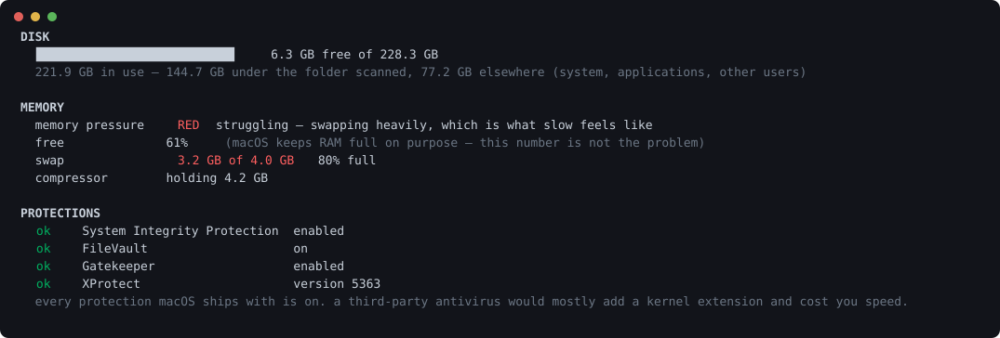

# strata

[](https://github.com/KRISH123no/strata/actions/workflows/ci.yml)




**Why is this Mac unwell?** Three questions that are really one: the disk is full, the memory is
full, and something might be running that should not be. macOS answers all three badly — "System
Data: 47 GB", a memory figure that is always high and means nothing, and a security model you cannot
see the state of.

strata takes a snapshot, keeps the history, and answers from it. It never frees, cleans, deletes or
quarantines anything. It prints the command and leaves it to you.

```bash
pip install -e ".[dev]"
strata health          # disk, memory and protections, in one answer
strata scan            # take the first snapshot
strata install         # and one every night from now on

strata since 7d        # what ate the disk — the reason this exists
strata leaks           # what takes memory and never gives it back
strata security        # what has started launching itself since last time
strata safe            # what is only cache, and the command to clear it
```

No dependencies. Everything it needs ships with macOS and with Python.

## The part a listing cannot tell you

One scan says what is **big**. Everyone already knows what is big — the photo library, the browser,
the models you downloaded once. That was never the question. The question is what *changed*, and
only a history answers it:

```
$ strata since 7d
29 Sep 22:21  →  6 Oct 22:21   (7.0 days)
  free space -2.7 GB, now 8.7 GB

    +6.2 GB  …/Library/Containers/com.amazon.aiv.AIVApp   managed
    -3.6 GB  ~/Downloads                                  yours
    +2.6 GB  ~/Library/Caches                             reclaimable
  +840.0 MB  ~/Library/Developer/CoreSimulator            reclaimable

  at this rate the disk is full in 12 days — around 18 Oct
```

## Memory: the honest version

The commonest Mac complaint is "my RAM is always full", and the commonest product sold against it
does not work. macOS fills idle memory with cache **on purpose** — pages holding recently-read files
stay resident because reading them again is free, and the moment an app needs that memory the cache
is dropped. A cleaner that "frees" RAM forces the system to throw away a cache it was using
deliberately: the number rises and the next few minutes are slower. That is not a bad implementation
of a good idea.

So strata frees nothing. It measures the things that actually hurt — compression, swap, and the one
question worth asking:

```
$ strata leaks
  Leaky                 412.0 MB/hour   1.2 GB → 4.1 GB   over 9 readings
```

**A leak is a shape, not a size.** Two conditions, and both matter. A positive trend alone catches
any app you happened to use more of — a browser climbs all afternoon and gives it all back when you
close a tab. So it must also have **never meaningfully retreated**: the largest drawdown from its
running peak stays near zero. That separates a leak from an afternoon without knowing anything about
the application.

Helpers are summed into the app they belong to. Forty rows of `Helper (Renderer)` is not an answer.

## Security: an audit, not a scanner

A third-party antivirus on a Mac usually adds a kernel extension, scans files the system already
vets, and costs performance for it. Four protections ship with the machine, and the only honest
question is whether they are on:

```
  ok    System Integrity Protection  enabled
  ok    FileVault                    on
  ok    Gatekeeper                   enabled
  ok    XProtect                     version 5363
```

The second question is the one a scanner cannot answer and a history can: **what has started
launching itself since last time?** Malware on macOS persists through the same launchd mechanism as
everything else. strata does not judge whether a launch agent is good or bad — it reports what is
new, which is the thing you can actually act on.

## Attribution is the hard part, not subtraction

If `~/.cache/uv` grows by two gigabytes then so does `~/.cache`, and `~`, and `/Users`. All four are
true, and printing all four is the same two gigabytes four times — each row a slightly longer path.
A report that does that has handed the arithmetic back to the reader.

So every directory is charged only with **what its children do not explain**. Walk deepest-first,
attribute each change to the most specific path that accounts for it, subtract it from the nearest
ancestor that is itself reported, and a parent appears only when it grew for reasons of its own.

"Nearest *reported*" carries weight: directories under the size floor are not stored, so the chain
has gaps, and stopping at the first missing link would leave the growth charged to nobody.

The same rule governs `now` and `safe`. Every row is space no other row also counts, so a column of
figures adds up to something real.

## What macOS does not volunteer

**`df` counts purgeable space as free.** On APFS, space held by caches and snapshots that the system
*could* release is reported as available. It is a promise, not a fact, and you find out the
difference when a copy fails on a disk that said it had room. `diskutil` knows the real number, so
strata reports both and names the gap.

**Local snapshots are invisible.** Time Machine leaves them on the boot volume. They hold real
gigabytes and appear in no walk, in Finder, or in About This Mac — a large part of what Apple files
under "System Data".

**`du` counts hard links and clones once per name.** A file reachable down three paths is three
files to `du` and one file to the disk. Copy a folder in Finder and APFS clones it: no new bytes,
and a naive walk reports the space twice. Every file here is counted once, by inode.

## It will not delete your things

Four kinds, and the distinction is the whole point:

| | |
|---|---|
| **reclaimable** | a cache or build output. Deleting it costs time, not data |
| **managed** | an app's own store — emptied from inside the app, not with `rm` |
| **yours** | documents, code, pictures. Never suggested, ever |
| **off-limits** | caches that are ruinous to rebuild. Reported, never recommended |

`strata safe` only ever lists the first kind, and only when nothing protected sits inside it.
`~/.cache` looks exactly like a cache and holds the package caches that must not be touched;
suggesting the parent would be suggesting its children.

## What the tests check

```bash
pytest -q      # 168 tests, under a second
ruff check .
```

Only `volume.py` needs a Mac, and it shells out to `df`, `diskutil` and `tmutil` — each one a seam a
test replaces with a canned answer. Everything else is arithmetic over dataclasses, so CI runs on
Linux too.

Bugs the suite caught:

- **A grandparent reported losing two gigabytes it never had.** Passing a change up to *every*
  ancestor counts the same bytes once per level, because a parent's own figure already includes them
  and it passes that figure up in turn.
- **`strata safe` offered `~/.cache`** — 12 GB of "cache" with the protected package caches inside it.
- **The demo had a folder that shrank while its contents grew.** Impossible in a real tree; it came
  from inventing parent totals instead of rolling them up from the leaves. The attribution was right
  and the data was wrong.
- **Multi-line expressions inside f-strings** are Python 3.12, and this claims 3.11.

## Layout

| File | Lines | Role |
|---|---:|---|
| `cli.py` | 555 | the commands and the nightly agent |
| `report.py` | 234 | bars, sizes, and what is safe to say |
| `memory.py` | 254 | pressure, swap, and the shape of a leak |
| `walk.py` | 172 | sizing a tree, counting each file once |
| `classify.py` | 111 | what a directory is, and whether to touch it |
| `store.py` | 235 | the history, in one SQLite file |
| `security.py` | 142 | the protections macOS has, and what is new |
| `diff.py` | 148 | attribution and the forecast |
| `demo.py` | 73 | a pretend fortnight |
| `volume.py` | 98 | what the filesystem says about itself |
| `model.py` | 67 | the three types |

2,098 lines of implementation, 1,197 of tests.

## Not implemented

- **macOS only.** `volume.py` is 98 lines against three system tools. The walk and the
  arithmetic are portable; a Linux port means `statvfs` and losing the APFS-specific parts, which
  are most of the reason this exists.
- **It does not read what it cannot read.** System files outside your home folder need privileges
  this does not ask for, so a home-folder scan explains most of a personal Mac and never all of it.
  The coverage line says how much.
- **`~/Documents` is skipped by default**, along with iCloud Drive and Messages. macOS puts them
  behind a permission prompt, and a nightly job asking for access to your documents — every night,
  forever, to produce a size figure — is not a trade worth making. `--private` opts back in.
- **Snapshots are listed, not sized.** `tmutil` names them; working out what each one holds needs
  more than it will tell you.
- **No live view.** It answers questions about the past, which is the thing nothing else does. For
  what is big right now there are good interactive tools already.
- **The classifier is rules.** It will not recognise every application's store, and it says
  "unknown" rather than guessing.

## Licence

MIT.
